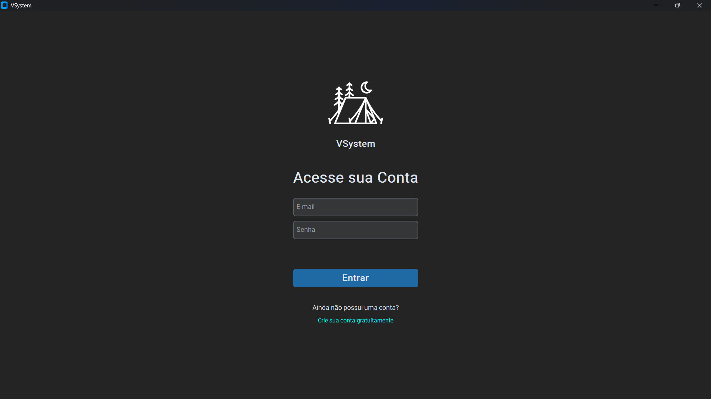

# VSystem ✨

**VSystem** é um aplicativo desktop moderno para gerenciamento pessoal.  
Com ele, você pode controlar alunos, estoque e produtos de forma simples, segura e sem complicações.



---

## 🚀 Destaques

- 🔐 **Login seguro** com senhas criptografadas (`bcrypt`)
- 🎨 **Interface intuitiva e moderna** com `CustomTkinter`
- 💾 **Dados persistentes** e salvos automaticamente
- ⚙️ **Pronto pra uso**: sem instalação, é só baixar e executar
- 📦 **Empacotado com PyInstaller** (versão `.exe` disponível)

---

## 🗂 Estrutura do Projeto

```
src/
└── sistema/
    ├── assets/icons/    # Ícones e imagens
    ├── config/          # Configurações do sistema
    ├── core/            # Lógica base do app
    ├── features/        # Funcionalidades (loja e escola)
    ├── ui/              # Componentes da interface
    ├── utils/           # Funções utilitárias
    ├── app.py           # Ponto de entrada
    └── __init__.py
```

---

## 💻 Como Executar (Modo Desenvolvedor)

> Requer Python 3.10+

```bash
git clone https://github.com/Cabana021/vsystem-manager.git
cd vsystem-manager
pip install -r requirements.txt
python main.py
```

---

## 🖥️ Como Usar (Versão Executável)

1. Vá até a aba [Releases](../../releases) e baixe o arquivo `.zip`.
2. Extraia os arquivos.
3. Execute o `VSystem.exe`.

---

## 🧰 Tecnologias Usadas

- Python
- CustomTkinter
- Pillow
- Bcrypt
- CtkTooltip
- PyInstaller

---
